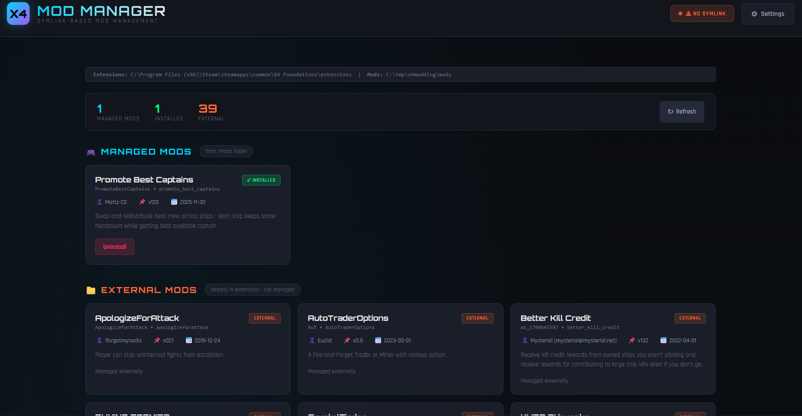

# X4 Mod Manager 🚀

Simple FastAPI web app to manage X4: Foundations mods via symlinks.



## Quick Start

```bash
cd x4-mod-manager
pip install -r requirements.txt
python main.py
```

Open http://127.0.0.1:9480

## Symlinks on Windows

Requires one of:
- **Developer Mode** enabled (recommended) - Settings → Developer settings → ON
- **Run as Administrator** - Use `run-admin.bat`

## Structure

```
x4-mod-manager/
├── main.py           # FastAPI backend
├── templates/
│   └── index.html    # Web UI
├── requirements.txt
└── run-admin.bat     # Auto-elevate launcher
```

## License

MIT

